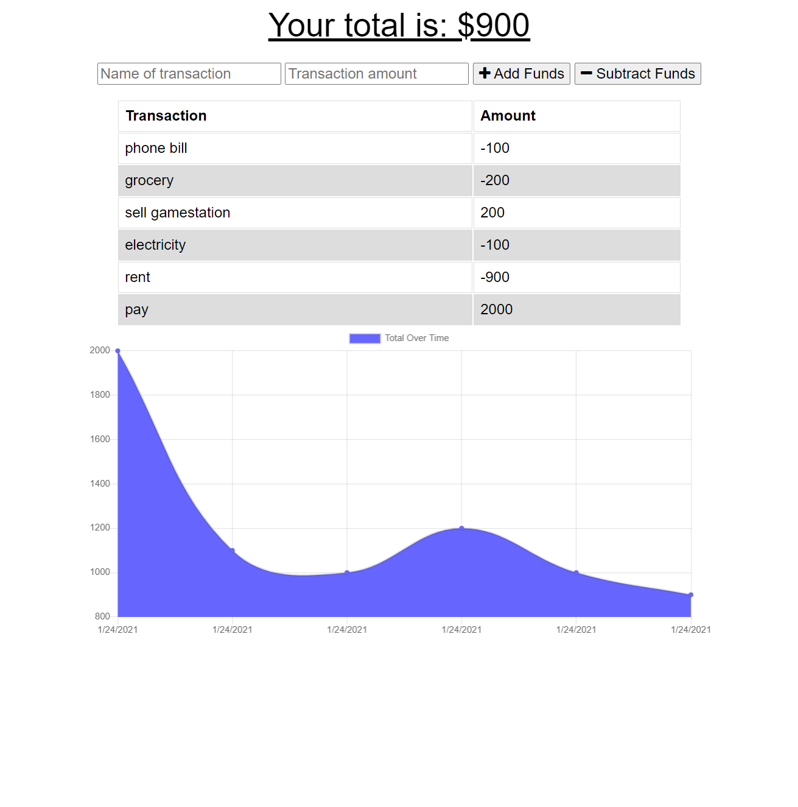

# Budget Tracker Starter Code

## Purpose

Update an existing budget tracker application to allow for offline access and functionality. The user will be able to add expenses and deposits to their budget with or without a connection. If the user enters transactions offline, the total should be updated when they're brought back online. 

## User Story

AS AN avid traveler  
I WANT to be able to track my withdrawals and deposits with or without a data/internet connection  
SO THAT my account balance is accurate when I am traveling 

## Installation

To install this application locally, clone this repository with `git clone https://github.com/maiyiax/pwa-budget-tracker.git`. Install the dependencies listed below but running `npm install`.
 
Start the application by running `npm start` and opening localhost in your browser. Note that this application uses MongoDB. Please reference the [MongoDB](https://docs.mongodb.com/guides/server/install/) website for installation instructions if you don't currently have it.

## Dependencies

 - [Compression](https://www.npmjs.com/package/compression)
 - [Express](https://www.npmjs.com/package/express)
 - [Mongoose](https://www.npmjs.com/package/mongoose)
 - [Morgan](https://www.npmjs.com/package/morgan)
  
## Application

This application can also be used at it's deployed link on [Heroku](https://safe-meadow-57026.herokuapp.com/)

Below is a screenshot of how the application looks:

## Contributors

Starter code provided by [UW-Bootcamp](https://github.com/coding-boot-camp/symmetrical-bassoon).
